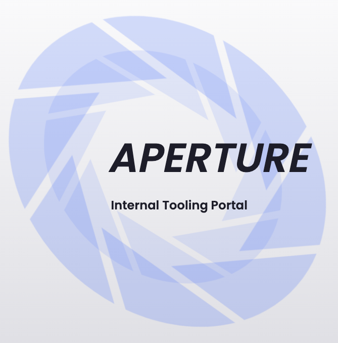
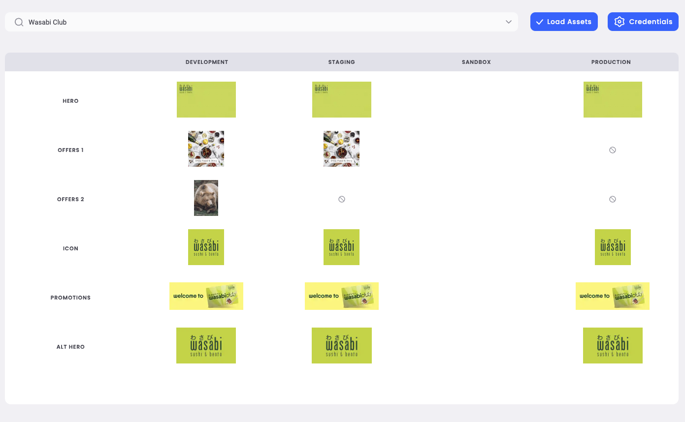
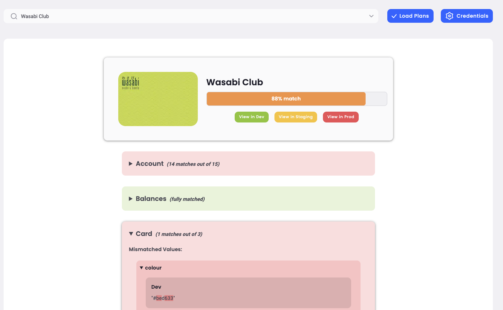
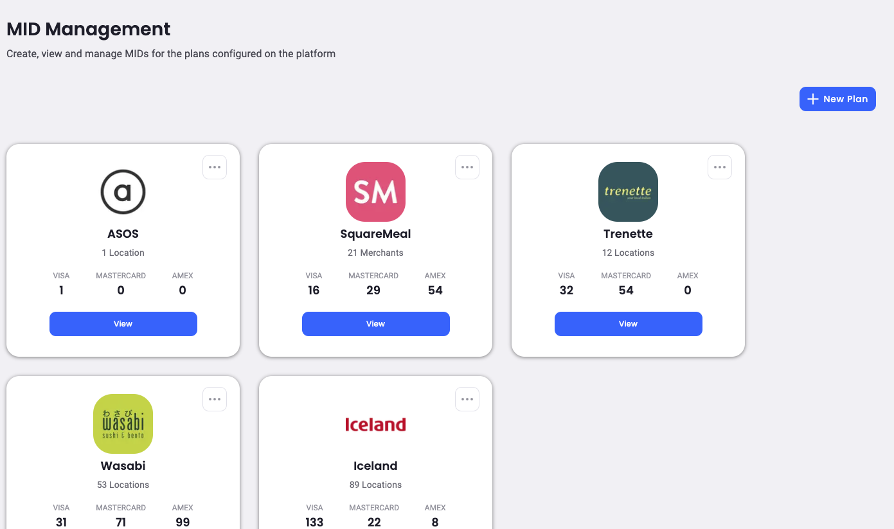
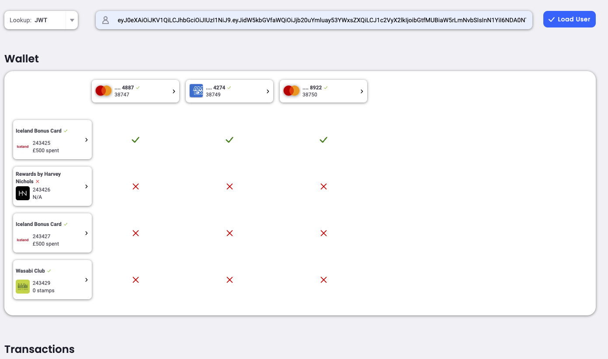

<h1 align="center">
  <a href="https://github.com/binkhq/aperture">
    <!-- Please provide path to your logo here -->
    
  </a>
</h1>

  Aperture
   
  <a href="#about"><strong>Explore the screenshots »</strong></a>
   
   
  <a href="https://hellobink.atlassian.net/jira/software/c/projects/MER/boards/172/backlog?view=detail&selectedIssue=MER-2151&issueLimit=100">Report a Bug</a>

Table of Contents

- [About](#about)
  - [Built With](#built-with)
- [Getting Started](#getting-started)
  - [Prerequisites](#prerequisites)
  - [Installation](#installation)
- [Roadmap](#roadmap)
- [Contributing](#contributing)
- [Authors & contributors](#contributors)
- [Security](#security)

---

## About

Aperture aims to provide tooling to simplify several workflows that exist in the company. It is a front-end app that uses [Bullsquid](https://github.com/binkhq/bullsquid) backend to run.

The current tooling:

- Asset Comparator - Compare the images for a given plan across environments
- Plan Comparator - Compare everything else for a given plan across environments
- Mid Management - Manage MIDs, locations, secondary MIDs and PSIMIs
- Customer Wallets - View a customers transactions, payment and loyalty cards

Screenshots

 

### Asset Comparator

### Plan Comparator

### Mid Management

### Customer Wallets

---
### Built With

The main technologies used throughout are: 

- NextJs
- React
- Typescript
- Redux Toolkit with RTK Query
- Jest
- TailwindCSS

## Getting Started

### Prerequisites

- Node, version greater than 14
- Yarn Package Manager

There may be others that have been forgotten about.
### Installation

1. Clone this repo locally
2. Install via `yarn install`
3. Run a local dev server with `yarn dev`

Open [http://localhost:3000](http://localhost:3000) with your browser to see the result.
## Roadmap

See the [Merchant Jira Board](https://hellobink.atlassian.net/jira/software/c/projects/MER/boards/172/backlog?view=detail&selectedIssue=MER-2151&issueLimit=100) for an overview of whats planned and what needs working on.

## Contributing

Please read [our contribution guidelines](docs/CONTRIBUTING.md), for more details on how things are set up, common gotchas and preferred ways of working. Thank you for getting involved!
## Contributors

There is a whole team but those who actually put code into this repo are: 

[Lukie Kang](https://github.com/neosaurrrrus) - Front End Development

Nathan Read - DevOps/CI Pipeline

## Security

Aperture follows good practices of security, but 100% security cannot be assured. For more information our [Snyk page](https://app.snyk.io/org/web-n3o/project/0c5bf933-4a5b-4755-b2fa-cd27a76ddf4c).

