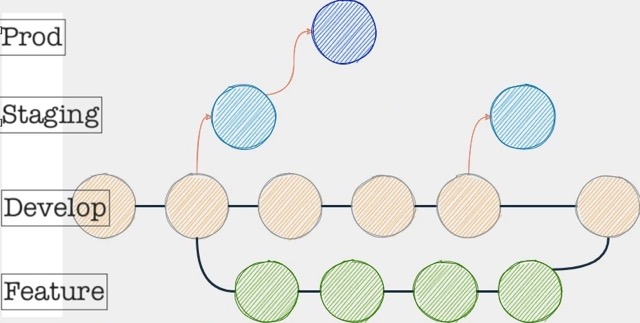

<h1 align="center">
  <a href="https://github.com/binkhq/aperture">
    <!-- Please provide path to your logo here -->
    
  </a>
</h1>

# About

This is a guide, not a strict rulebook but we ought to have a good reason to make exceptions. Being consistent is king but nothing is ever set in stone, if we feel another approach is better, let's change it up. I am not going to spell everything out, but to introduce the codebase and flag anything that might trip you up which getting to grips with it.

# The very basics
## File structure

So you have cloned the app and you are wondering how the folder structure is the way it is.... let me take you for a quick tour. Before you panic, we will get into more detail on the concepts referenced later in this doc.

### Root

The core of the app is in Src, so the root is home to config files for our various libraries (which ill get to later), CI and env files

The env files are used to hold values used by Sentry, Auth0 and Next across the following environments:

- Local
- Dev
- staging
- Prod

If you do not have a local env file, then thats because it isn't included in our version control. Speak to another Dev or product owner for a copy.
### Src

Lets lets go in alphabetical order here:

- __tests__ - These are unit tests for **pages** only, other unit tests live with thier components.
- app - Config for our redux store, mostly reducers.
- components - Shockingly this is where our components live. We use an index model to make referencing components somewhat easier. This means every component has its own folder with an index.ts file to refer to the component tsx file. Top level components also are added to the components/index.ts file. Modal components live in the Modals folder and rely on the ModalFactory to render based on what modal is requested via Redux.
- features - In Redux toolkit, this is where we keep our redux slices
- hooks - Where we store our custom hooks if they have scope beyond a singular component. Mostly this contains files that help with with making api calls.
- icons - Where we keep small icon files (typically in the svg folder). Sometimes public is used in the root folder
- lib - Contains auth0 config.
- pages - contains our NextJS pages and is used for routing. Also the api folder is used for auth0 config.
- services - Our api calls to the backend grouped by area of concern using RTK Query
- styles - This contains a few global CSS settings, including some Tailwind custom classes for classes we use everywhere such as Typography
- types - contains a file containing our global Type definitions in typescript. If a type exists in more than one component, it is defined and referenced from here.
- utils - Handy little functions that can be used across multiple components live here to be referenced accordingly.

# Our Frameworks
High-level things to know about our use of various frameworks that differ from what you might expect. This is the part of this guide that is most likely to go stale so lets do our best ot keep it updated when we change things.

## Typescript

This was the first large project where Typescript has been used and it probably shows in the immaturity of how we are using Typescript features but its something we are improving upon as we go.

Some common patterns are are:

1. We define global types (i.e not just used in one component) in the types folder. 
2. We confirm the types used for component props at the start of a components file.
3. We use enums for ensuring and centralising global string values only. The [global enums file is here](../src/utils/enums.ts) 

Otherwise expect a little variation in how things are done as our thinking in Typescript has evolved. The only golden rule we have is to avoid deliberate use of `any` as a type. We can normally find something that works instead.

## NextJs

- We are currently on Next 12.

- We deploy a [static HTML export](https://nextjs.org/docs/advanced-features/static-html-export) which limits the features we can use. This was a decision made to make DevOps' life easier and at the time we did not know how we were going to use NextJS features that this prevents. 

In the long term, it is a goal to utilise more of Next's features. In particular, seeing how static, server-side and client-side rendering choices can improve performance.

## Redux Toolkit with RTK Query

These frameworks perform two main tasks:

1. Perform and store API data
2. Store and provide data between components where passing it between props is impractical.  

Our data layer follows much of the standard boilerplate found in the RTK/RTK Query documentation so that's a good start place for learning more. Generally we try and split up files by area of concern to avoid a huge singular file. 
### Example API call process

From the backend to the component the typical pattern we use is as follows:

1. Build the API call in the relevant file in Services using the RTK format. In reality you are better off copying a similar one and changing it. Make sure the created query or mutation is exported once you are done.

2. To better support situations we we need to make multiple API calls in the same component, we have a corresponding custom hook in the hooks folder (e.g services/midManagementPlans and hooks/useMidManagementPlans). This exposes each available property with a unique name. Any required arguments are defined here as well as skipTokens. Due to the nature of hooks, we need to use skipTokens to stop the running of all Queries within that particular hook.  

3. Import the required properties into the component, using skip tokes and providing arguments as needed.

Its bit of a boilerplate-y process but it is pretty robust and ensures we can be smart about avoiding unneeded API calls. RTK Query in particular has a lot of quality of life and performance improvements that we can look into.

## Unit Testing with RTL/Jest

This is an interesting one as I am not fully happy with how we do testing thus far. Our coverage is fairly decent, the experience of writing unit tests is poor. We write unit tests for every page and component file that renders something to:

1. Catch any unintended changes
2. Document the important things the component should do.

The test file for each component should be kept in the same location s the component. For pages we keep them in the __tests__ folder.

Internet arguments fly about what good unit testing is but our current thinking is using the Acceptance criteria in the Jira tickets as a good starting point to base tests upon. Any bug tickets are great prompts to write additional tests to cover that scenario. However we also subscribe to the notion that unit tests have their limitations, especially when most of our components have multiple dependancies that involve heavy amounts of mocking to make work. The more I work with React/Redux/Next/Hooks the less inclined I am see the value of unit tests over end-to-end and integration testing. See [Kent C Dodds on this](https://kentcdodds.com/blog/write-tests)

As a rule we do not practice TDD for new features due to the many unknowns a new feature will present us with. As we write unit tests against a given component its hard to write the tests first when we don't know the architecture we will end up with. Smaller feature tickets help with this, and maybe thinking differently about our design patterns. At time of writing QA are looking to develop an end-to-end test suite for Aperture so am seeing what the testing landscape looks like once that is complete before seeing how we can improve this.
## TailwindCSS 

We have some set classes in [globals.css](../src/styles/globals.css) for some very common use cases. 

There you will also find some common CSS for scrollbar styling as thats quite bespoke.

The [Tailwind config file](../tailwind.config.js) is where we typically set our colour pallette as well as extending with additions not found in Tailwind by default.

Otherwise we are happy to populate elements with classes as needed, if we repeat a set of classes often in a component we can set it is as a const to reduce duplication as well as breaking things into components.

We **support Dark Mode** note that every element with a colour set will have a dark equivalent where needed.

## ESLint

Do we prefer tabs over spaces, or consts over var's? ESlint should stop you worrying about all that and saves me a bunch of typing. Check out the `.eslintrc.json` file in the app root to see how we like things. But this is just preference if you like something to be different, it can be changed. On **very** rare occasions we can override the linting rules for a given line, but it should be because the alternative is worse...

Linting errors (in red) normally will not be fixed on save, but any warnings (in yellow) will auto fix on save so don't worry about being too neat and tidy as you code.
## Husky

Husky (check out the .Husky folder in root) is our pre-commit and pre-push hook runner.

Before any **commit** Husky will:

- Check for Typescript errors
- Fix any fixable linting issues

Before any **push** Husky will do the above and run all unit tests to make sure we do not push anything up that is failing tests.

## Auth0

Auth0 is our authentication mechanism to make sure that only Bink employees get access to Aperture in three flavours of access:

- Read (Reader)
- Read/Write (Writer)
- Read / Write / Delete (Admin)

We apply these permissions to UI elements (mostly Buttons) to govern if the user has access to them. The main hook that governs this is [usePermissions](../src/hooks/usePermissions.ts) and is baked into our custom Button elements for example.

We can test the user permissions a logged in user has via a hidden [Permissions Page](../src/pages/permissions.tsx).

As for the Auth0 overall setup and configuration , thats a little too in-depth for this guide but its worth knowing much of the setup was in following the NextJS setup for Auth0 and can be found online.

## Sentry

Sentry is our error and exception tracking software and can be accessed via https://bink.sentry.io/issues/?project=6175755
If you don't have access someone in DevOps should be able to sort you out.

Again, the config follows typical NextJS setup found online to allow Aperture to talk to Sentry.

## SVGr

SGVr allows us to componentise our SVG files and thus have better control of them. You'll notice it is used wherever we are using SVGs so its best to keep using that pattern.

## Headless UI

There are a few tricky UI elements to code so in a couple of places we have used [Headless UI](https://headlessui.com/) to help us develop the following components:

- Dropdown
- TextInputGroup (part of...)

Since we use it already it makes sense to consider it  if need be elsewhere over a different library.

## Just ...

You will notice in the package.json we have a few little libraries called just-*something*. This is a minor shout out to the [Just suite of libraries](https://github.com/angus-c/just) for doing those little annoying helper functions that would be time consuming to write ourselves. We favour Just as they are written without any other dependencies and minimal size which saves us a headache when vulnerabilities are found. Think of it as our preferred lodash, underscore.js, jquery option.

# Our Code Standards

Ok, so we haven't talked about the code itself. Life is too short for me to go through every typescript and react pattern we use, ESlint can help with much of that and hopefully the rest of it can be deduced from existing components. So again here I just want to highlight any weirdness and high-level principles that matter when writing code for Aperture.

## Browser Compatibility

So good news, Aperture is used by Bink Internal people so we can assume we can use modern browser features. Any feature that is supported by mainstream versions of Chrome(ium), Firefox and Safari should be good to use in our code. As always Safari tends to be an outlier so often worth testing any visually interesting code we write on Safari in particular.

## Generic UI Components

You need to make a button so you start typing `<button....` STOP! We have a component for that and a few other things. They mostly exist to reduce duplication and keep styling consistent across multiple areas of the app so they are worth knowing about before duplicating thier functionality. 

- Button
- ContentTile
- Dropdown
- Modal (a Higher Order Component around the modal content)
- OptionsMenuButton
- PageLayout
- PaymentCardIcon
- PlansList
- Tag
- TextInputGroup

They all live in the components folder, there are other components used in multiple places but at least they will be scoped within a particular component folder (and thus a certain part of the app).

## Accessibility

We make a point to take Accessibility seriously and (thus far) Aperture has fairly decent Accessibility. Broadly speaking we are aiming for AA-standard of [WCAG2.1](https://www.w3.org/TR/WCAG21/). We might have a few things forgotten about here or there but if we find them lets fix it up.

I won't go over all the things we need to look out for to ensure we are aiming for AA-standard but suffice it to say, making sure any components are screenreader-only and keyboard-only friendly is a big chunk of it. I recommend using AXE linter for VSCode as well as the AXE chrome extensions to run audits of the stuff we write.

Its fine if we are not perfect but lets try and do what we can, avoid anything deliberately inaccessible,  and flag up any potential accessibility challenges during refinements.

## Responsiveness

We currently are assuming Aperture uis being run on a Macbook Pro with at least a 13inch screen.

Its a current todo list item to try and gracefully handle Aperture when smaller viewports are used.

## Security

So we need to use a new package? Probably worth a sanity-check with a colleague. If its a simple function to write ourselves we probably should but let's not be too dogmatic, sometimes we need an external library. 

Just one thing before you install it, run an audit of the node package using a CLI-tool called '[NPQ](https://github.com/lirantal/npq)
.NPQ audits a given package and helps flag up any issues of concern prior to installing it. If there is something of concern it flags up, let's discuss.

## Images

SVGs are typically stores in `src/icons/svgs` and are used accordingly. 

Where we use non-SVGs or are in need of the NextJs Image handling component (i.e when not using a SVG) we also store image files in the public folder in the root.

## Modals

We have a lot of modals. So much so we have a particular pattern for calling them via Redux. I will walk you through as its a little weird.

### Creating a modal

1. The request to render a modal lives in the NextJS Layout component which calls a ModalFactory component.
2. ModalFactory then decides which modal to actually render, note the use of a ModalType enum to help keep things in order.
3. The modal itself (which lives in the modals folder, is always wrapped by a general Modal Higher Order Component which governs the generic modal appearence and behaviour).
4. The modal component is wrapped by a FocusTrap componet which is part of a library to easily ensure keyboard focus remains with in the modal.

### Requesting a modal

If a button wants to call a specific modal we dispatch an action to our redux store to set what modal should be requested: `    dispatch(requestModal(ModalType.MID_MANAGEMENT_BULK_COMMENT))`. 

To dismiss a modal (for example after a successful api call) we have to send another action to set the modal requested to none like so: `dispatch(requestModal(ModalType.NO_MODAL))`

Its a bit weird but it  keeps things super consistent which is useful when modals can be very tricky from a visual and accessibility standpoint.
## Vulnerability Management

Synk is our current tooling for ensuring we are informed of new vulnerabilities in Aperture. However at time of writing this is about to be phased out. We are not sure if there is anything that will replace it currently so cannot tell you what we will do instead about vulnerability reporting.

However as a general rule we treat package vuonerabilities with the following urgency:

1. Critical - As soon as is discovered, or at least once you have finished whatever it is you are doing. Create a new sprint ticket if need be.
2. High - To be addressed in the next sprint, create a ticket if need be.
3. Medium/Low. Review the vulnerability and, unless there is a special case, we will typically address them when we have spare time.

There might be special cases where we do something different but thats the general rule of thumb. By keeping on top of things we normally can avoid massive package upgrades with more risk of not knowing what particular change broke everything.

# Development Pipeline

Phew, nearly there. Now you are ready to *Get Things Done* but need to know how we typically get from a Jira ticket, to the code being deployed on production. Lets go through that process to show the conventions we use.

## Git strategy

We use Gitlab Flow as our branching strategy which looks like this:

 

 QA uses the staging branch to do their thing so we normally update staging each time we update develop.

So my typical workflow to add a feature goes like this:

1. Create a new local feature branch from Develop (making sure its the latest version from Github), I will typically call this '*ticket reference* - *short description*'  So a Jira ticket that is 'MER-2013' should have a feature branch that starts with 'MER-2013 -'

2. Commit early, commit often is good advice. We use [Conventional Comments](https://www.conventionalcommits.org/en/v1.0.0/#summary) as a guide for good commit messages, small commits rarely need more than a sentence to explain. We don't normally have a reason to squash them so you don't have to.

3. Push the local branch to the remote and create the PR. With Jira being the source of information and good commit messages we don't typically add much in the way of description, but anything interesting/tricky/weird can be added.

4. Request a code review, its worth pinging the other Dev(s) on Team to let them know. If its urgent or a tiny change, its good to point that out. More on code reviews later...

5. If review is good, merge the PR into Develop. 

6. ** Important ** - We use the GitHub release tags to trigger a deployment to staging. This involves creating a new release tag (https://github.com/binkhq/aperture/releases/new) which is in the format of '1.<sprint increment>.<increment>'  ... that will make more sense when you see it. We just generate the release notes using hte handy button on that page.

7. Publishing the new release will trigger a GitHub action to deploy to staging, this typically takes 15 mins or so. Let QA know you have done this, move the ticket to 'QA in progress' and pat yourself on the back,well done!

8. .... Wait, no, QA have found a defect you need to fix! If the defect is not better raised as a bug you need a hotfix... in which case that new feature branch is prefixed with 'hotfix-1-MER-XXX'

## Code Reviews

This section is TBC as that can be decided when we have multiple devs again. General principle, don't make it overly burdensome, be curious, offer suggestions, communicate well and politely.

# Culture stuff

One last thing, I promise. We are a small team but we (used to) have standards in how we work to make it a nice place to be and a nice codebase to code for. Some of these points probably conflict with each other, its not always possible,  just treat them as guidelines rather than strict rules.

- Take your time - Explore different approaches, play around with the related code and consider all angles. Give yourself the time it needs, it will make for better code in the long run when you, and only you, choose how long to spend on it.

- Just ship it - You took your time but .... you are still not happy with how you have coded a feature? Or just can't figure it out at all? You could spend days banging your head against it or you can just submit the draft PR explaining what you are not happy with and we can figure it out together. Do that, saves a whole heap of time and angst. Lean on your fellow front-end dev(s), review process and QA, they are probably good at what they do. 

- Make changes small, make them often. In our refinement sessions, try and find ways to make the feature requests small and manageable (one common trick is splitting out visuals and functionality into their own tickets). Small tickets are easier to test, review, and QA as well as reducing chances of merge conflicts. Try to resist the lure of throwing multiple tickets into a single feature branch.

- Technical debt is a useful tool to keep focus on the feature itself, we make time each sprint to tackle tech debt so we use it often, just be sure to create the tickets.

- Solve problems at the root. Let's try and address the cause and not the symptom. If a feature requires workarounds and hacks, lets try and address the root cause of why that is. (adding the task to tech debt is our friend here)

- Do not accept weird system behaviour. When a system repeatedly exhibits behaviour that we can’t explain, it’s easy to become collectively accustomed to it and treat it as “normal.” A good example of this is console warnings in the browser. We make sure our new code does not create more errors and warnings. If its beyond the scope of the feature itself we make sure it is in the tech debt pile. 

- Write code to be read by humans. If code is hard to understand, its hard to spot bugs. Prefer long descriptive names, prefer multiple simple functions and components rather than one thing that does it all via spagetti code... and prefer to use more lines of code if it makes the code clearer. Feel free to comment anything that is unavoidably unintuitive, or cannot be summarised via its name (useEffect hooks for example)

- If you can’t show it’s a bottleneck, don’t optimise it. Correctness is nearly always more important than performance. Because optimisation generally increases code complexity, only go after performance when you are sure its running at a sufficiently large scale that the gains will be significant. Again, using tech debt for such things is your friend.

- Unblock others whenever you can.  If someone is waiting on you for a code review, prioritise it ahead of writing new code yourself.

- Leave the codebase better than you found it. You’re are never stepping on anyone’s toes by trying to make things better. This is doubly so for this document you are reading now.

All done, now lets make some cool things!